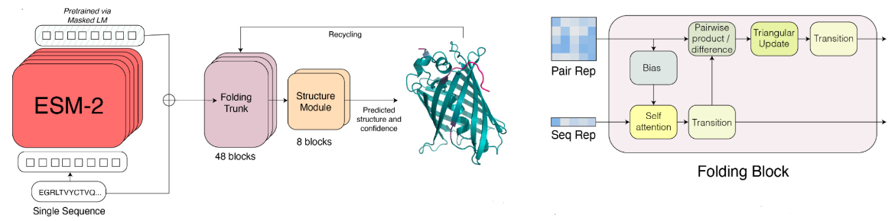

# ESM-2 model
* využíva transformer architektúru s 15 biliónmi parametrov
* základom je BERT encoder 
  * natrénované pomocou predikovaniania náhodne vynechaných aminokyselín v proteínových sekvenciách na základe ich kontextu
  * naučené vzorce a závislosti medzi aminokyselinami v sekvenciách
* modifikácia: pozície tokenov zakódované pomocou Rotary Position Embedding-u 
  * model môže extrapolovať mimo kontextové okno, na ktorom je trénovaný 
  * vyššia výpočtová náročnosť - násobenie query and key vectorov v self-attention sínusovými embeddingmi
* naučený attention pattern korešponduje tertiárnej štruktúre
* dataset: UniRef50, UniRef90

## ESMFold
* predikcia štruktúry zo sekvencie
* rýchlejšie ako existujúce riešenia založené na MSA (multiple sequence alignments)
* accuracy: high-confidence predictikcie sa približujú experimentálnym  
* novelty: predikuje nepozorované štruktúry
* môže identifikovať štrukturálne podobné proteíny, ktoré sa nezhodujú v sekvencii
* dataset: PDB, štruktúry generované AlphaFold2 pomocou MSA
  * validačný: CAMEO
  * testovací: CASP14
* model má skryté stavy:
  * init: naučený vážený súčet ESM embeddingov prejdený cez MLP
  * init pairwise: pairwise relatívne pozičné kódovanie (Jumper et al.)

* skladá sa z 2 častí (modulov):
  
  * ### folding module
    - zjednodušený Evoformer blok (využívaný v AlphaFold2)
    - adaptovaný na jednodimenzionálne featury LM: nahradenie axial-attention štandardnou
    - self-attention používa bias odvodený z pairwise representácii
  * ### structure module
    - výstupom sú 3D súradnice atómov a ich confidence
    - equivariant transformer architektúra 
    - invariant point attention (AlphaFold2)
    - 3 kroky recyklovania