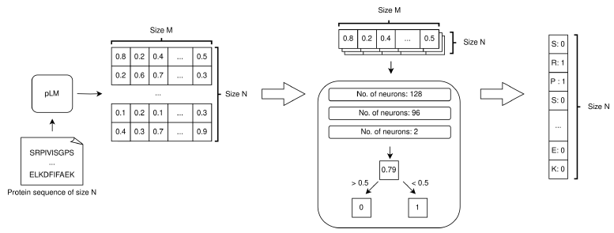
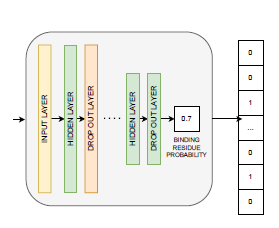

# Predikcia väzobných miest zo sekvencie
Sekvencia je zakódovaná pomocou jazykového modelu ([ESM-2](ESM.md)) do embeddingov, ktoré sú vstupom do neurónovej siete, ktorá pre každú aminokyselinu rozhodne či je súčasťou väzovného miesta.

## Neurónová sieť
* Vrstvy:
  * vstupná
  * 3 skryté (128, 96, 2)
  * drop-out (po každej skrytej) 
* Aktivácia: ReLU + L2 regularizácia
* Loss: binárna cross-entrópia

## Datasety:
* [BioLip (Yu et al.)](http://www.csbio.sjtu.edu.cn/TargetS/Datasets.html) 
* CryptoSite