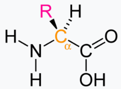
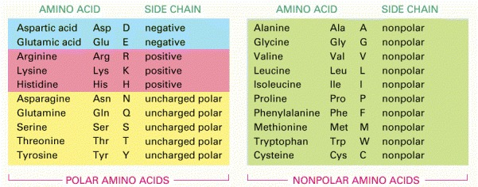
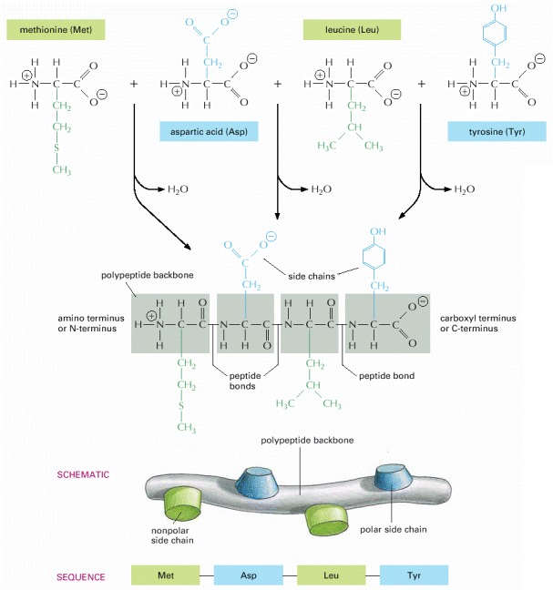
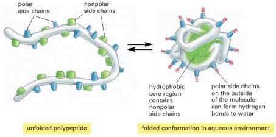
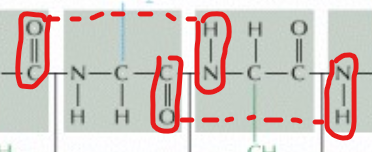
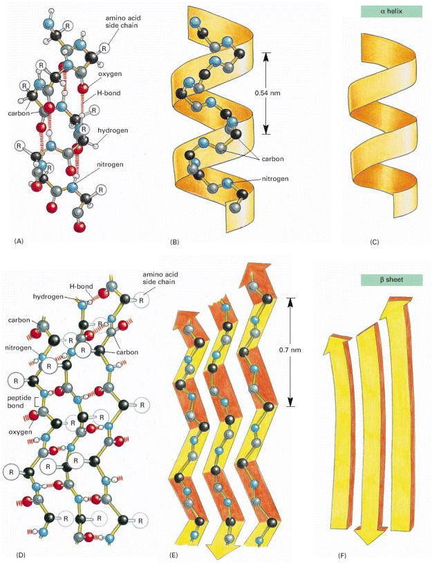
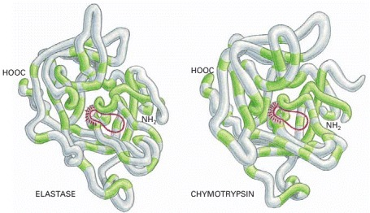
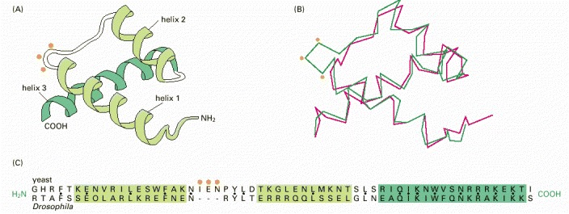

---------------
Zdroj: https://www.ncbi.nlm.nih.gov/books/NBK26830/
---------------

# Aminokyselina
  
Aminokyselinu možno rozdeliť na 4 základné časti:
- ***-NH2*** (N-koniec) 
- ***Cα*** (α-uhlík)  
- **R** - Bočný reťazec (Side chain)  
-  ***-COOH*** (C-koniec)  

Existuje 20 aminokyselín, ktoré tvoria proteíny. Každá má odlišné chemické vlastnosti. Sekvencia sa zapisuje vždy N-to-C, teda od N-konca po C-koniec.

 

*non-polar -> hydrofóbne*

# Proteín
Proteín tvoria aminokyseliny (reziduá) spojené peptidovými väzbami (zvyčajne 50 až 2000 a.k.). Každý proteín tvorí unikátna sekvencia aminokyselín.  
  

## Folding & patterns

   

Folding vo vode -> polárne bočné reťazce (side chains) aminokyselín sa tlačia na okraj proteínu aby reagovali s vodou, nepolárne - hydrofóbne sa zhlukujú v strede (kryjú sa pred vodou).

Polárne reťazce sa viažú s polárnymi molekulami (voda, ďalší polárny reťazec, polypeptide backbone) cez vodíkové väzby.

### α helix

Vodíkové väžby medzi `N-H` a `C=O` tvoria špirálovitú konformáciu.

 

### β sheet (skladaný list)

Keď priľahlé reťazce smerujú opačným smerom tak reťazce tvoria medzi sebou vodíkové väzby.

   

## Organizácia štruktúry proteínu

### Primárna

Sekvencia aminokyselín

### Sekundárna

**Úsek** polypeptidového *(aminokyselinového)* reťazca. Patria sem napr. helix a list.

### Terciárna

3D organizácia **jedného** polypeptidového reťazca.

### Kvartérna

3D organizácia **viacerých** polypeptidových reťazcov.

## Proteínová doména

V rámci molekuly proteínu je možné rozlíšiť tzv. domény. Doména je časť proteínu (40 až 350 a.k.), ktorá je sama schopná vytvoriť nezávisle stabilnú terciárnu štruktúru. Rôzne domény sú asociované s rôznymi funkciami.

   

## Rodiny proteínov

Proteíny sa vyvíjajú tak, aby mohli plniť nové funkcie. Tento proces viedol k vytvoreniu rodín protinov, v ktorých majú proteíny podobné sekvencie a štruktúry. 

Príklad rodiny: **Serínové proteázy**

Veľké časti ich sekvencií sa zhodujú, no taktiež sa podobajú aj v 3D konformácií.

No v mnohých prípadoch sa sekvencie aminokyselín odlišujú natoľko, že si nemôžeme byť istí príbuznosťou proteínov bez určenia ich trojdimenzionálej štruktúry.

Príklad rodiny: **Homeodoména**

*3 oranžové bodky reprezentujú 3 aminokyseliny, ktoré boli počas evolúcie 1 miliárd rokov vložené do proteínu.*

Len **17** z 60 aminokyselín zhodných reziduí *(na obrázku čierna bodka medzi nimi)*, no ako môžeme vidieť na obrázku časť (B), ktorá zobrazuje pozície Cα daných bielkovín.  

Foldseek prichádza s riešením tohto problému vďaka tkz. 3Di reprezentácií proteínu, kde je sekvencia aminokyselín nahradená novou "abecedou", ktorá nesie okrem typu aminokyseliny informáciu o susedných reziduách a ich vlastnostiach.

### Pre zaujímavosť

Few of the Many Possible Polypeptide Chains Will Be Useful
Since each of the 20 amino acids is chemically distinct and each can, in principle, occur at any position in a protein chain, there are 20 × 20 × 20 × 20 = 160,000 different possible polypeptide chains four amino acids long, or 20n different possible polypeptide chains n amino acids long. For a typical protein length of about 300 amino acids, more than 10390 (20300) different polypeptide chains could theoretically be made. This is such an enormous number that to produce just one molecule of each kind would require many more atoms than exist in the universe.

Only a very small fraction of this vast set of conceivable polypeptide chains would adopt a single, stable three-dimensional conformation—by some estimates, less than one in a billion. The vast majority of possible protein molecules could adopt many conformations of roughly equal stability, each conformation having different chemical properties. And yet virtually all proteins present in cells adopt unique and stable conformations. How is this possible? The answer lies in natural selection. A protein with an unpredictably variable structure and biochemical activity is unlikely to help the survival of a cell that contains it. Such proteins would therefore have been eliminated by natural selection through the enormously long trial-and-error process that underlies biological evolution.

Because of natural selection, not only is the amino acid sequence of a present-day protein such that a single conformation is extremely stable, but this conformation has its chemical properties finely tuned to enable the protein to perform a particular catalytic or structural function in the cell. Proteins are so precisely built that the change of even a few atoms in one amino acid can sometimes disrupt the structure of the whole molecule so severely that all function is lost.