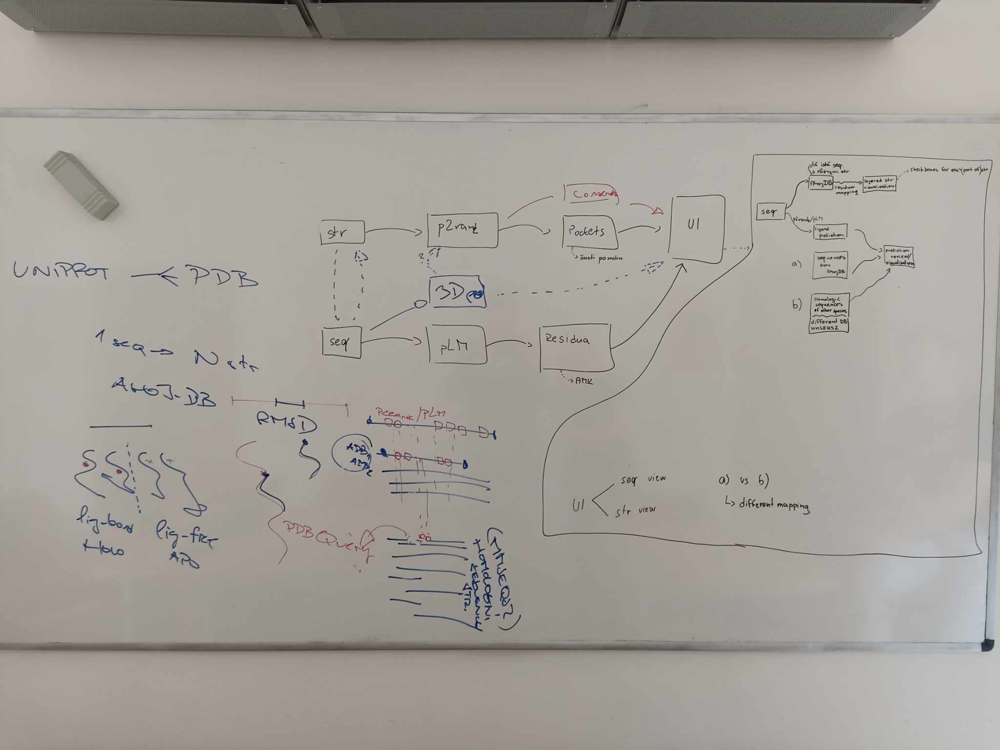
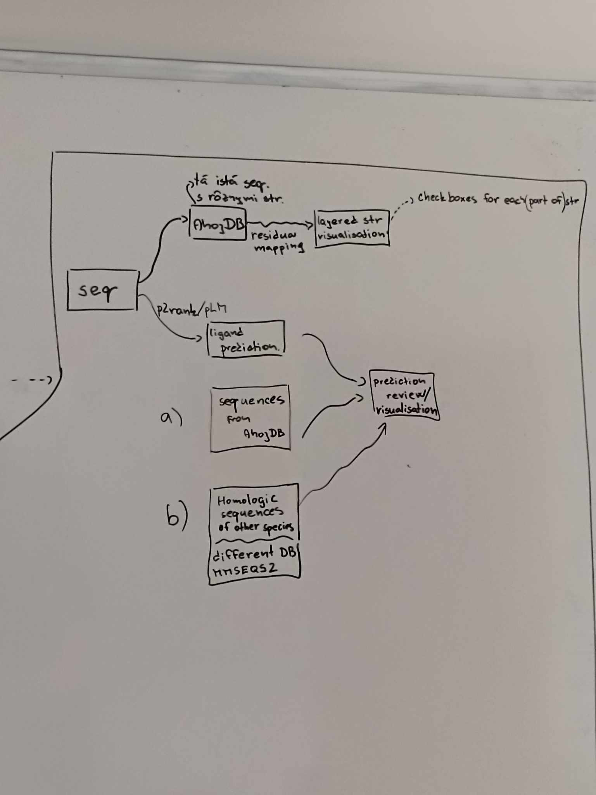

# Zápisnica z meetingu 05.06.2024

## Účastníci

- p. Hoksza
- Katka Bucková
- Samuel Karaš
- Milan Truchan

## Prebrané témy

### Organizačné záležitosti

- Zvolenie teamleadera: Milan Truchan

- Priradenie rolí:
  - AI: Katka Bucková
  - Backend: Samuel Karaš
  - Data/BIO: Richard Fedák
  - Frontend: Milan Truchan

- Výber platformy GitHub / GitLab
  - vyhral GitHub

- Okrem GitHub-u je potrebné si zvoliť nejakú komunikačnú platformu
  - preferované sú Mattermost a Slack

- Ukážky zámerov a špecifikácií
  - zámer
    - 1-3 strany
    - v podstate stačí premeniť obrázky z tabule na slová na papieri
  - špecifikácia
    - väčší dokument, kľudne aj 30 strán
    - všetko by malo byť premyslené

- Diskusia o časovej lehote odovzdania špecifikácie od schválenia zámeru
  - 2 mesiace vs. žiadna lehota

- Organizácia meetingov
  - mali by byť pravidelné, raz za 1-2 týždne
  - je nutné spisovať zápisnicu

### Téma SW projektu

## TODO

- Dohodnutie ďalšieho stretnutia zameraného na biologické aspekty SW projektu
- Vytvorenie repozitára na GitHub-e
- Zvolenie komunikačnej platformy
- Zistiť, či je nejaká časová lehota medzi schválením zámeru a odovzdaním špecifikácie
- Dohodnutie "prázdninového režimu"