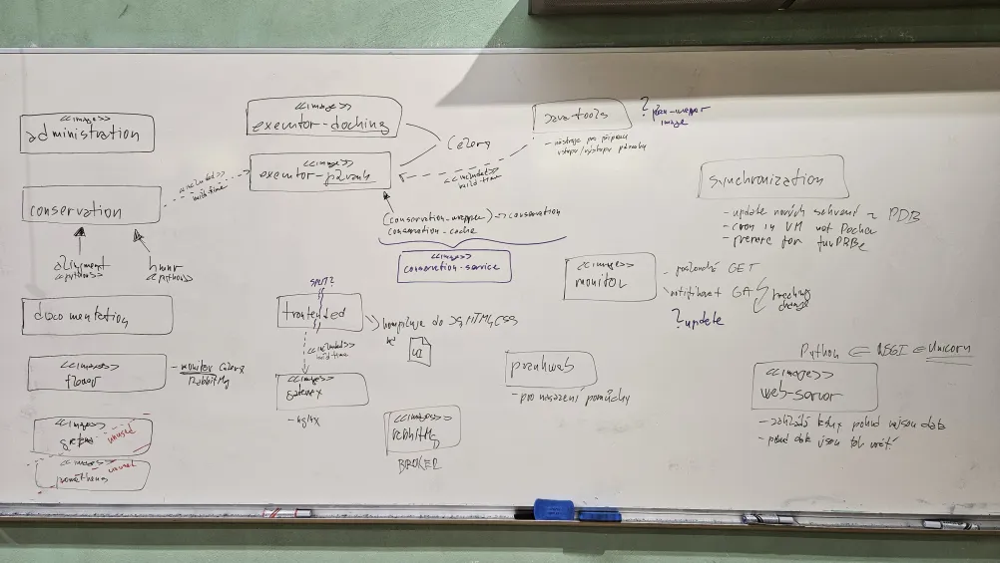
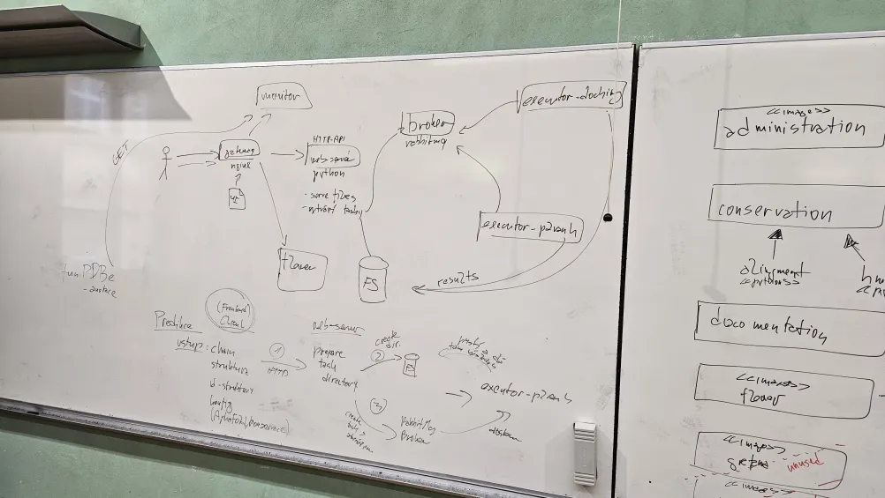

# Zápisnica z meetingu 11.07.2024

## Účastníci

- p. Škoda
- Samuel Karaš
- Richard Fedák

## Prebrané témy

- Prankweb repozitár - architektúra

### Tabuľa

## TODOs

### Samostatne pozrieť, zoznámiť sa, tutoriály
- KB - pLM intro, ESM model
- SK - RabbitMQ, Celery, Docker
- MT - nginX, rcsb-saguaro, typescript-React
- RF - MMseqs2, Ahoj-DB
  
### TODO
- Dohodnutie ďalšieho stretnutia zameraného na biologické aspekty SW projektu 
- Navrhnúť use cases, scenáre (čo bude robiť užívateľ, server atď.)
- Spisovať špecifikáciu
- (Upravovať zámer)
