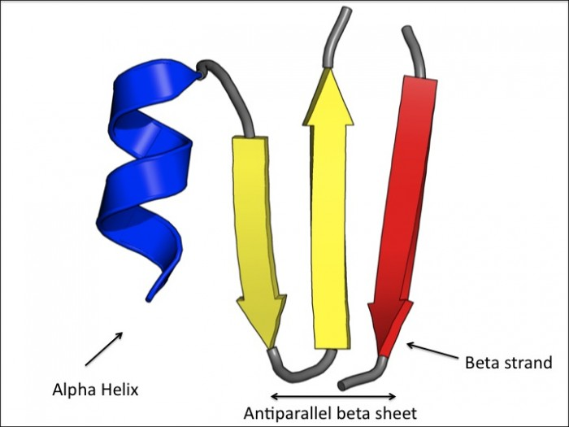
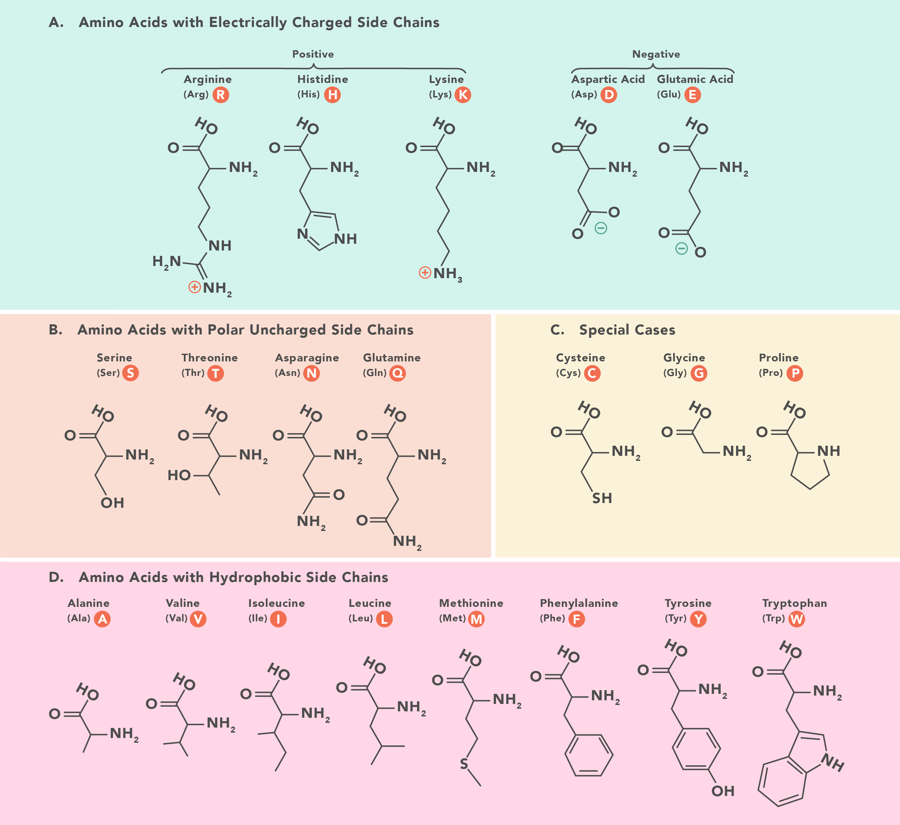

# Zápisnica z meetingu 16.07.2024

## Účastníci

- p. Novotný
- Celý tím

## Prebrané témy

- Experimentálne spôsoby zistenia štruktúry proteínov - je náročné ...
- Poznáme (cca):
  - 3mld sekvencií proteínov
  - 200tis štruktúr (experimentálne získaných)
  - 200mil štruktúr (predikovaných pomocou AlphaFoldu)
- Základné konformácie (časti):
  - α-helix (špirála)
  - β-skladaný list (šípky) - poprepájané smyčkami/slučkami

- Alignment
  - Každá aminokyselina má jednopísmenovú skratku (20 základných)
  - Podobnosť aminokyselín:
    - Hydrofóbne aminokyseliny
      - podobné fyz/chem vlastnosti
      - zámena je možná
      - Leucín a Izoleucín
    - Pozitívne nabité
    - Negatívne nabité
    - Hydrofilné

# TODOs

## Samostatne pozrieť, zoznámiť sa, tutoriály

### -----PRIDAŤ ODKAZY/LINKY/ZDROJE-----
- KB - pLM - [intro](https://www.youtube.com/watch?v=ekDaxrbloC0), [ProtTrans](https://arxiv.org/pdf/2007.06225), [ESM model](https://www.biorxiv.org/content/10.1101/2022.07.20.500902v3.full.pdf)
- SK - [RabbitMQ](https://www.rabbitmq.com/tutorials), [Celery](https://docs.celeryq.dev/en/latest/), [Docker](https://docs.docker.com/guides/workshop/)
- MT - nginX ([1.](https://youtu.be/JKxlsvZXG7c), [2.](https://youtu.be/9nyiY-psbMs)), [rcsb-saguaro](https://github.com/rcsb/rcsb-saguaro), [typescript-React](https://youtu.be/FJDVKeh7RJI)
- RF - [Foldseek](https://www.youtube.com/watch?v=k5Rbi22TtOA), [Ahoj-DB](https://apoholo.cz/about)
  
### TODO

- Aminokyseliny [EN](https://en.wikipedia.org/wiki/Amino_acid), [SK](https://sk.wikipedia.org/wiki/Aminokyselina)
- Bielkoviny [EN](https://en.wikipedia.org/wiki/Protein), [SK](https://sk.wikipedia.org/wiki/Bielkovina)
- <del>Dohodnutie ďalšieho stretnutia zameraného na biologické aspekty SW projektu</del> 
- Navrhnúť use cases, scenáre (čo bude robiť užívateľ, server atď.)
- PyMol
- Spisovať špecifikáciu
- (Upravovať zámer)
