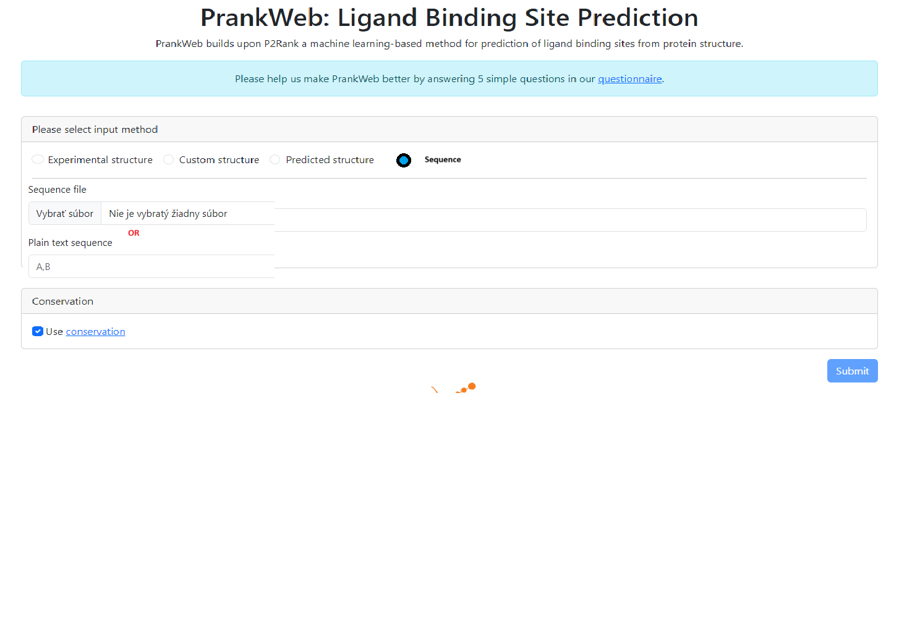
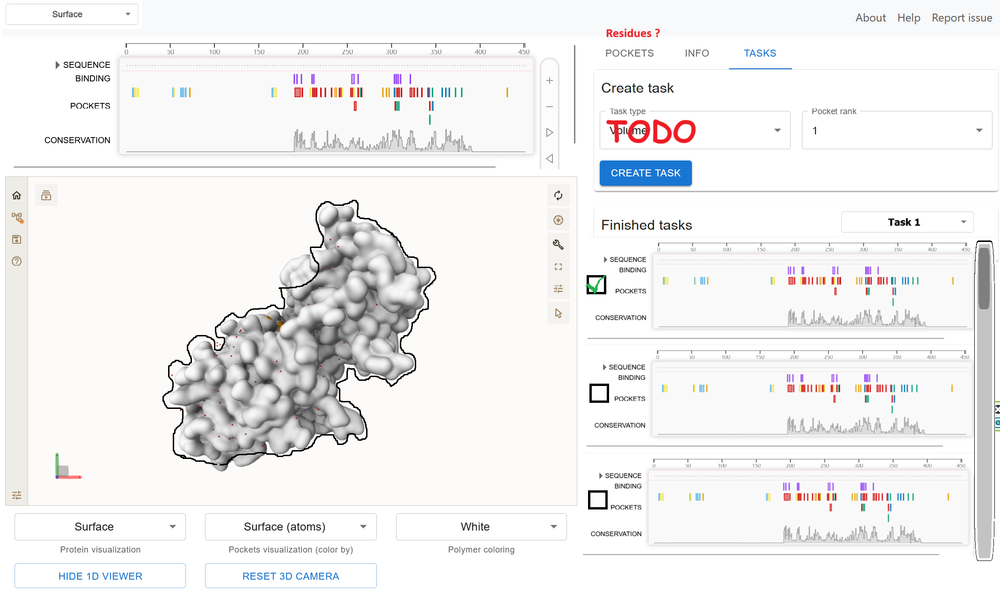

# Zápisnica z meetingu 28.07.2024

## Účastníci

- Celý tím

## Prebrané témy

- Vzájomné oboznámenie sa s technológiami (na základe TODO z 16.07.2024)
- Brainstorming návrhu use cases a s nimi súvisiacich funkčných a systémových požiadavkov
- Prvotné nákresy obrazoviek

### Úvodná obrazovka

### Obrazovka s vizualizáciami a taskami

## TODO

- Vyriešiť časť [obrazovky](#obrazovka-s-vizualizáciami-a-taskami), kde sa vytvárajú "tasky"
- Pokračovať v návrhu use cases
- Spisovať špecifikáciu
- (Upravovať zámer)