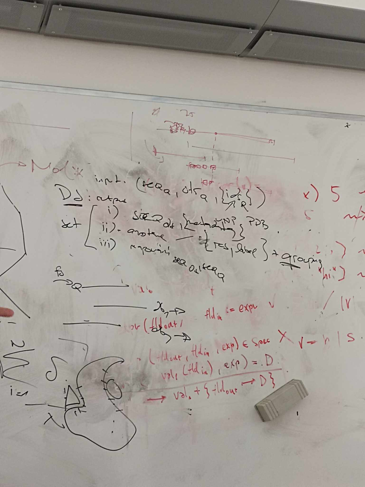
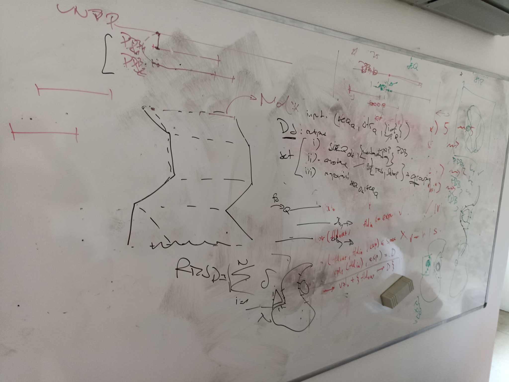
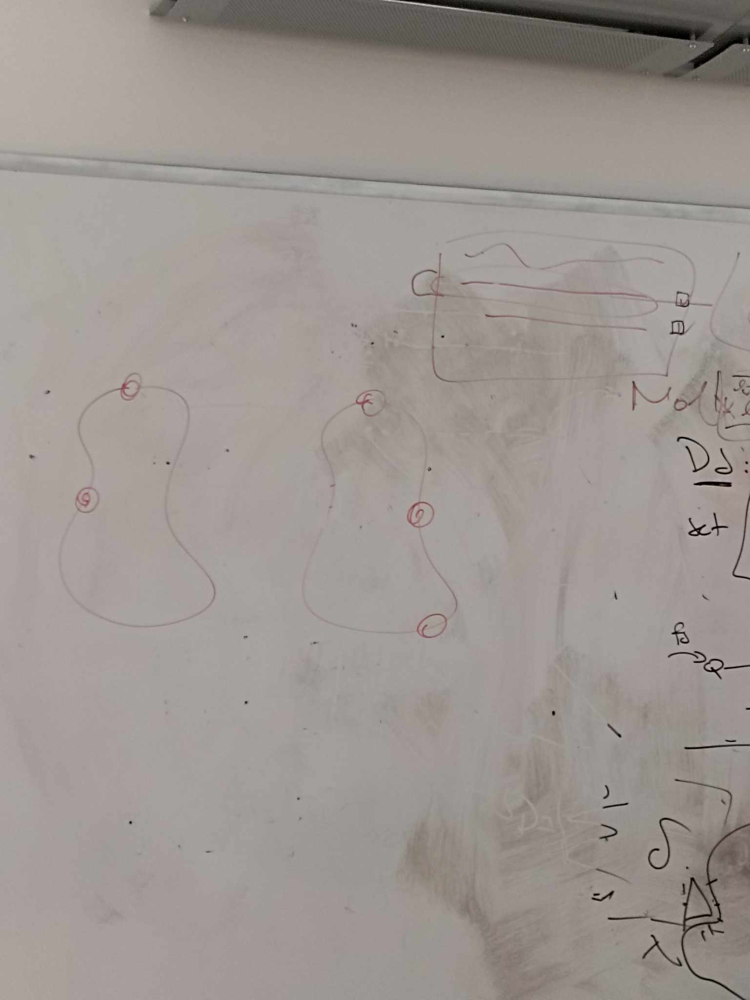
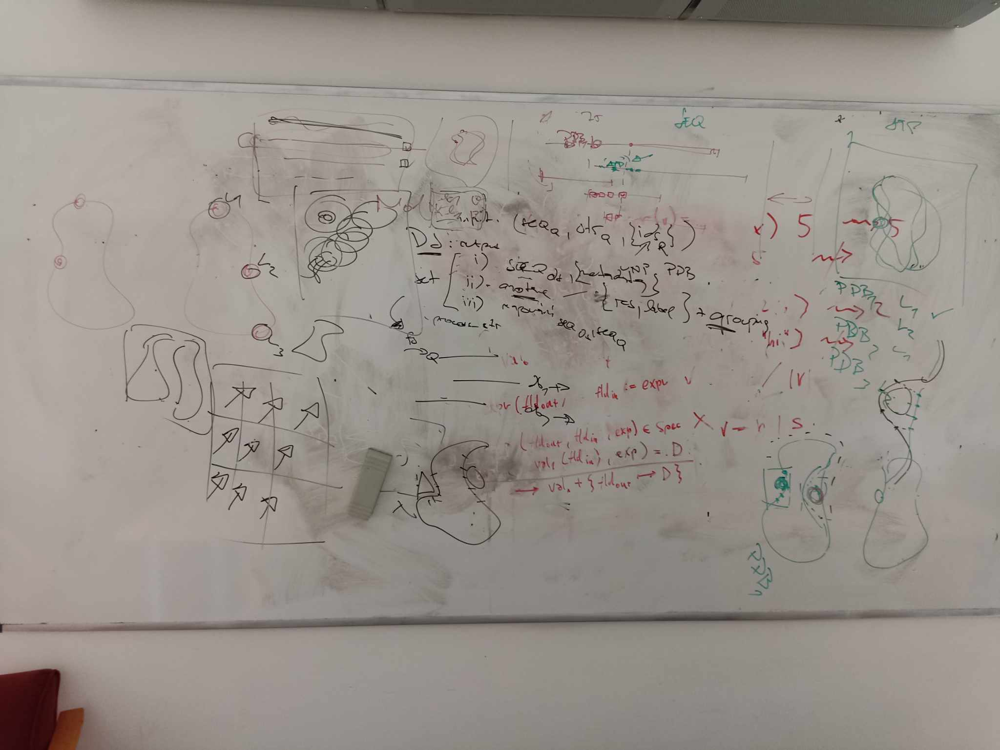

# Zápisnica z meetingu 03.10.2024

## Účastníci
- p. Hoksza
- celý tím

## Prebrané témy
- Prebrali a vysvetlili sme si superpozicovanie
- Navrhli nové UI funkcionality (zobrazovanie ligandov, ktoré sa dá zapínať/vypínať)
- Prešli sme poznámky/otázky k dátovej časti 

# Fotky tabule

## TODO

- Pracovať ďalej na špecifikácii
- Navrhnúť UI vzhľadom k spomínaným funkcionalitám
